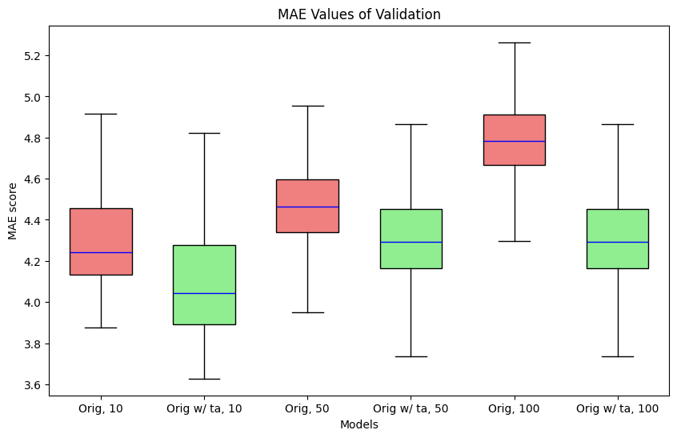

# Optiver Trading Competition

## Overview
This project performs feature engineering and modeling on order book time series data to evaluate the effectiveness of Technical Analysis features in light of predicting the `target`

The main tasks include:

- Exploratory data analysis
- Feature engineering
    - Technical indicators (RSI, MACD, Bollinger Bands)
    - Time-weighted order book features  
- Feature selection
    - Correlation analysis
    - Filter-based (ANOVA) 
    - Wrapper-based (RFE)
- Modeling 
    - XGBoost
    - Hyperparameter tuning
    - Cross-validation

## Data
The `train.csv` dataset contains the following key features:

- `stock_id`: Stock identifier  
- `bid/ask_price`: Bid and ask prices in the order book
- `bid/ask_size`: Bid and ask sizes in the order book  
- `target`: The target variable to predict    

## Contents
**Data Exploration and Preprocessing**
- Handle missing values
- Feature scaling

**Feature Engineering**  
- Technical indicators
    - RSI
    - MACD
    - Bollinger Bands
- Time-weighted order book features  

**Feature Selection**
- Correlation analysis  
- ANOVA feature selection
- Recursive feature elimination

**Modeling**  
- XGBoost regressor
- Hyperparameter tuning with Optuna   
- Cross-validation

## Installation
This project requires Python 3 and the following libraries: 
- Pandas
- NumPy  
- Scikit-learn
- XGBoost    
- Optuna  

These can be installed with `pip` or conda.  

## Results    

We evaluated the impact of adding technical analysis (TA) features to our orderbook model across different numbers of stocks: 10, 50, and 100.  

The key hypotheses tested were:

1. TA features reduce MAE by **at least 10%** compared to no TA features.  
2. TA features reduce MAE compared to no TA features.

## Hypothesis 1 Results

H0: TA features reduce MAE by **at least 10%**  
H1: TA features reduce MAE by <10%

| # Stocks | Result |  
|:--------:|:------:|
| 10 | ✘ |   
| 50 | ✘ |   
| 100 | **✓** |    

- For 10 and 50 stocks, the >10% MAE improvement null hypothesis is rejected 
- For 100 stocks, the null >10% MAE improvement hypothesis holds

## Hypothesis 2 Results

H0: TA features reduce MAE     
H1: TA features do **not** reduce MAE  

| # Stocks | Result |
|:--------:|:------:|
| 10 | **✓** |
| 50 | **✓** |    
| 100 | **✓** |

- For all stock counts, TA features lead to lower MAE
- The alternative hypotheses are rejected

**Conclusion**: Adding TA features reduces model MAE compared to no TA features for all stock counts. However, the >10% MAE improvement only holds for 100 stocks based on the Welch test results.

